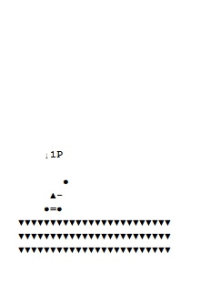
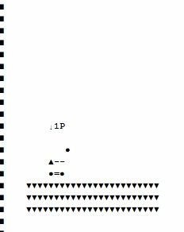
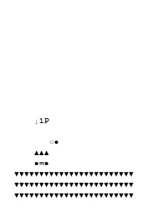

# Fortress

## 소개
자바 콘솔에서 만들어 본 포트리스 게임입니다.

## 주요 기능

### 규칙
상대방의 탱크를 먼저 잡는 플레이어가 승리합니다.

### 캐릭터
사용자가 고를 수 있는 탱크는 3가지가 있습니다. 
   
- 고대 탱크 
- 현대 탱크 
- 미래 탱크 

### 조작
화면과 상호작용 하는 방식으로 진행됩니다. 
1. 공격하기: 원하는 발사각을 입력 후 파워를 조절하여 미사일을 발사할 수 있습니다. 
2. 이동하기: 방향 설정 후 원하는 거리만큼 이동할 수 있습니다. 
3. 아이템 구매: 아이템을 구매할 수 있습니다. 더블샷, 공격력 강화, 체력 회복 등의 아이템이 있습니다. 
4. 턴 종료: 턴을 상대방에게 넘깁니다. 
5. 항복: 항복합니다. 
